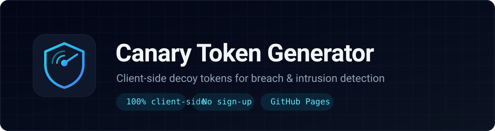

<div align="center">



[](./LICENSE)
[](https://github.com/armand-vw/Canary-Token-Generator/actions/workflows/ci.yml)
[](https://armand-vw.github.io/Canary-Token-Generator/)
[](#architecture)

**A sleek, dependency-light security utility for generating and deploying canary tokens —
web bugs, decoy PDFs, QR codes, fake credentials and `.env` bait — to detect unauthorized access.**

[**Live Demo**](https://armand-vw.github.io/Canary-Token-Generator/) · [How it works](#how-it-works) · [Webhook setup](#choosing-a-webhook-endpoint) · [Contributing](./.github/CONTRIBUTING.md) · [Security](#-security--ethics)

</div>

---

## Overview

A **canary token** (or _honeytoken_) is digital bait. It looks valuable but has no legitimate
use — so the moment it is accessed, you have a high-signal indicator that something is wrong.
Canary tokens catch attackers who have bypassed perimeter controls, insiders poking at data they
shouldn't, and secrets exfiltrated from repos or shared drives.

The Canary Token Generator is a static web app that mints these decoys entirely in the browser.
There is **no backend, no account, and no telemetry**. Generated tokens are stored only in your
browser's `localStorage` and alerts are delivered straight to a webhook you control.

> Deploy it anywhere that serves static files — GitHub Pages, Netlify, Cloudflare Pages, or even
> a local file server.

## Features

|     | Feature                                                                                                                 |
| --- | ----------------------------------------------------------------------------------------------------------------------- |
| 🕸️  | **Web Bug / Tracking Link** — unique URL plus ready-to-paste HTML, Markdown and cURL snippets                           |
| 🔳  | **QR Code Canary** — scannable QR rendered to SVG for print, slides or physical assets                                  |
| 📄  | **Decoy PDF Documents** — invoice / CV / handbook / memo templates built with `pdf-lib`, with an embedded tracking link |
| 🔑  | **Fake Credentials** — AWS key pairs, HS256-shaped JWTs and PostgreSQL connection strings, all tagged with a canary id  |
| 🗄️  | **Decoy `.env` / Config Files** — downloadable secrets files with a hidden tracking endpoint baked in                   |
| 📊  | **Token register** — local dashboard with search, filter, one-click copy, delete, JSON export/import                    |
| 📦  | **Deployment Kit** — export the whole register, snippets, decoy files, QRs and PDFs as a single ZIP                     |
| 🎯  | **Delivery options** — GET tracking pixel (CORS-safe) or POST JSON payloads, with automatic `no-cors` fallback          |
| 📱  | **Installable PWA** — offline-capable app shell, no account required                                                    |
| 🌙  | **Enterprise-style dark UI** — responsive Tailwind dashboard, Lucide icons, accessible focus handling                   |

## Architecture

```
index.html                 Layout, import map, Tailwind link, drawer + toast mounts
manifest.webmanifest       PWA manifest
sw.js                      Service worker (offline app shell)
assets/css/tailwind.input.css  Tailwind source (compiled -> styles.css)
assets/css/styles.css      Compiled stylesheet (committed)
assets/img/                Logo, icons and social preview
js/app.js                  Entry point: hash routing, configurator flow, dashboard rendering
js/tokenEngine.js          Canary id minting, decoy factories, beacon delivery, snippets
js/qrGenerator.js          QR-code SVG rendering
js/pdfGenerator.js         Lazy-loaded pdf-lib PDF builder + link annotation
js/kitBuilder.js           Deployment-kit ZIP assembly (fflate)
js/store.js                Versioned localStorage persistence with subscribe/export/import
js/ui.js                   Toasts, drawer, confirm dialog, clipboard, downloads, formatting
js/templates.js            In-app documentation content
tests/                     Vitest suites
config/                    Tooling config (eslint, tailwind, tsconfig, vitest)
.github/                   CI, issue/PR templates and project docs
```

- **No build step required to run or deploy.** Native ES modules load directly in the browser and
  the compiled CSS is committed. Tooling (`npm run build:css`, tests, lint) exists only for
  development and CI.
- **Lazy heavy dependencies.** `pdf-lib`, `qrcode` and `fflate` are imported only when their
  feature is used, keeping first load fast.
- **Pinned dependencies via import map.** The browser and the test runner resolve the same bare
  specifiers (`pdf-lib`, `qrcode`, `fflate`), so source is identical in both environments.

## Quality checks

CI runs on every push and pull request to `main`:

| Check             | Command                |
| ----------------- | ---------------------- |
| Lint              | `npm run lint`         |
| Formatting        | `npm run format:check` |
| Types (JSDoc)     | `npm run typecheck`    |
| Tests (51)        | `npm run test`         |
| CSS is up to date | `npm run build:css`    |

Run everything locally with `npm run verify`.

## How it works

1. **Generate** — pick a token type, give it a label and supply your webhook endpoint. The app
   mints a unique id (`ct_…`) and builds the decoy.
2. **Deploy** — place the decoy somewhere attractive but unused (a shared drive, an email
   signature, a repo, a CI variable list).
3. **Monitor** — when the token is fetched (GET) or your endpoint receives the JSON (POST), you
   get an alert containing the canary id, label, timestamp and page metadata.
4. **Respond** — the canary id maps back to the token's label and your notes in the dashboard.

### Choosing a webhook endpoint

| Provider                             | Works out of the box? | Notes                                                                                            |
| ------------------------------------ | --------------------- | ------------------------------------------------------------------------------------------------ |
| [Webhook.site](https://webhook.site) | ✅                    | Easiest for testing; permissive CORS.                                                            |
| Custom serverless function           | ✅                    | Cloudflare Worker, Lambda Function URL, Supabase Edge Function.                                  |
| Discord webhook                      | ⚠️                    | Browser `POST` is CORS-blocked and the payload shape differs — relay through a serverless proxy. |
| Slack webhook                        | ⚠️                    | Same CORS/payload caveats as Discord.                                                            |

The result panel includes a **Send test beacon** button so you can confirm delivery before
deploying. If a cross-origin `POST` is blocked, the app retries with `no-cors` so the request is
still delivered, and tells you when that fallback was used. `GET` tokens are unaffected by CORS.

<details>
<summary><strong>Example POST body your endpoint will receive</strong></summary>

```json
{
  "event": "canary.triggered",
  "canaryId": "ct_V8k2mQ1xR7pL4nT0wZ9aBc",
  "label": "Payroll Q3 draft",
  "type": "web-bug",
  "source": "canary-token-generator",
  "triggeredAt": "2026-09-15T12:00:00.000Z",
  "page": "https://example.com/portal",
  "severity": "high"
}
```

`severity` (and any other keys) come from the optional **custom payload** field and are merged
into the body.

</details>

### A note on decoy PDFs

Modern PDF viewers intentionally block documents from silently fetching remote resources, because
that behaviour is itself a tracking vulnerability. A PDF therefore **cannot reliably beacon on
_open_**. This tool embeds the tracking URL as a real `/Link` annotation, so the alert fires when a
reader **clicks** it. Treat the PDF as a click-triggered canary.

## Local development

The app itself has no runtime dependencies, but the dev tooling requires **Node.js 20+**.

```bash
npm ci
python3 -m http.server 8080   # or: npx serve .
```

Then open <http://localhost:8080>. If you change Tailwind classes, rebuild the committed CSS:

```bash
npm run build:css
```

See [CONTRIBUTING.md](./.github/CONTRIBUTING.md) for the full script list and project conventions.

## Deploying to GitHub Pages

1. Push this repository to GitHub.
2. Go to **Settings → Pages**.
3. Under **Build and deployment**, choose **Deploy from a branch**, select `main` and `/ (root)`.
4. Save — the site publishes at `https://<username>.github.io/<repo>/`.

The included `.nojekyll` file ensures GitHub serves the files exactly as-is. No build step or
Action is needed — the compiled stylesheet is committed, and CI verifies it stays in sync.

## Project status

See [CHANGELOG.md](./.github/CHANGELOG.md) for release history. Contributions are welcome —
read [CONTRIBUTING.md](./.github/CONTRIBUTING.md) and the [Code of Conduct](./.github/CODE_OF_CONDUCT.md) first.

## ⚠️ Security & ethics

- **Authorized use only.** Deploy canary tokens exclusively on systems, accounts and data you own
  or are explicitly authorized to monitor. Using them to track people without consent may be
  illegal in your jurisdiction.
- **Canary tokens are detection, not prevention.** They complement — never replace — access
  control, logging and incident response. Correlate a beacon with other telemetry before acting.
- **Review before you deploy.** Decoy credentials are structurally realistic but non-functional.
  Never place them near real secrets you rely on, and never point them at production systems.
- **Your data stays local.** Tokens live in `localStorage`; clearing site data removes them.
  Export your register to JSON if you want a backup.

To report a vulnerability, see [SECURITY.md](./.github/SECURITY.md).

## License

[MIT](./LICENSE) © 2026 Armand van Wyk

<div align="center"><sub>Built as a static, client-side security utility. Contributions and issues welcome.</sub></div>
